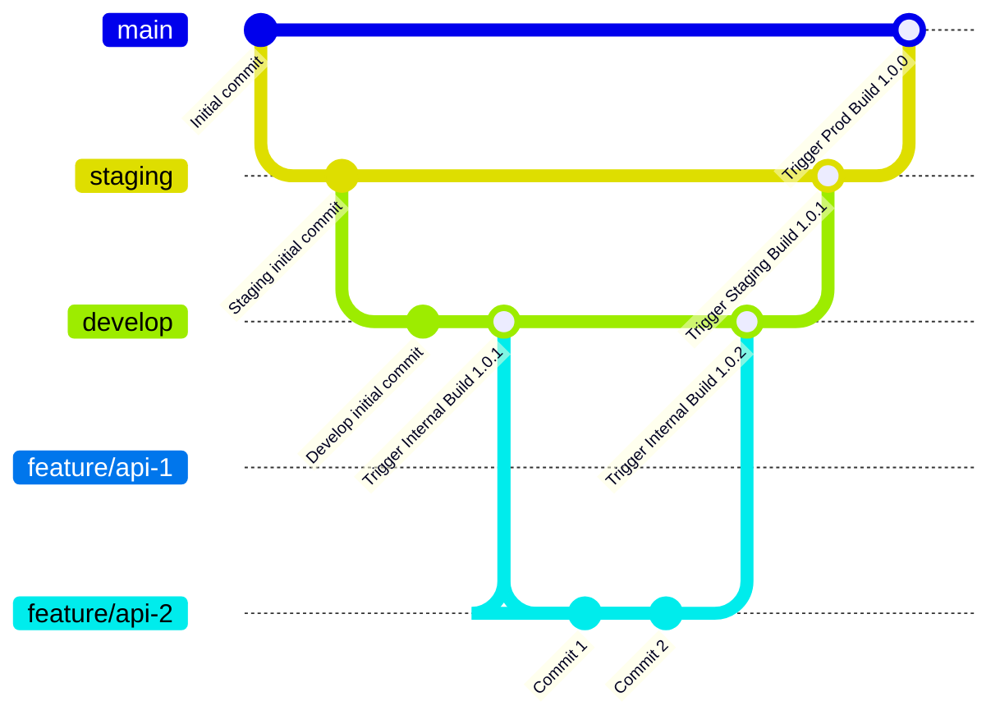

# 1BIS - All-in-One Business Solution

1BIS is a comprehensive business management platform designed to streamline operations for hospitality businesses. Our integrated solution combines multiple essential business functions into a single, powerful system.

#### Core Objectives

- Transform hospitality business operations through digital integration
- Provide a seamless, user-friendly experience for both staff and management
- Enable complete control over business operations and customer relationships
- Streamline administrative tasks and enhance operational efficiency

## Key Features

### Frontend Operations

### 🏨 Property Management

- 📝 Room and inventory management
- 🔄 Real-time availability tracking
- 📊 Occupancy analytics
- 🗓️ Booking and reservation system

### 👥 Customer Management

- 👤 Guest profile management
- 📱 Customer communication tools
- 💳 Payment processing
- 📊 Customer feedback system

### 🍽️ Service Management

- 🍳 Restaurant and dining management
- 🎯 Event planning and coordination
- 🧹 Housekeeping management
- 🚗 Transportation services

### Administrative

### 📊 Business Intelligence

- 📈 Performance analytics
- 💰 Financial reporting
- 📊 Revenue management
- 📉 Cost analysis

### 👥 Staff Management

- 👤 Employee scheduling
- 📋 Task management
- 📊 Performance tracking
- 💼 HR management

### 🔄 Operations Management

- 📦 Inventory control
- 🏷️ Pricing management
- 📋 Quality control
- 🔍 Compliance monitoring

## Author

- [1BIS Solutions](https://github.com/1BIS-solutions)

## Tech Stack

**Client:** React

**Server:** Node, Express

**ORM:** Prisma

**Database:** MongoDB

## Run Locally

Clone the project

```bash
  git clone https://github.com/1BIS-solutions/1BIS-api.git
```

Go to the project directory

```bash
  cd 1BIS-api
```

Install dependencies

```bash
  npm install
```

Spinup the server

```bash
  npm run dev
```

## Running Test

To run tests, run the command

```bash
  npm run test
```

## Running Lint

To run lint, run the command

```bash
  npm run lint
```

## Git Branching



## API Reference
